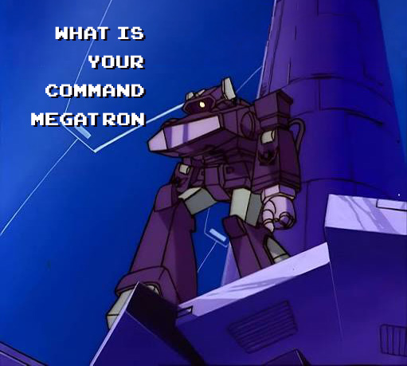

# Shockwave

*(Scroll down for Russian version / Прокрутите вниз, чтобы прочесть версию на русском языке)*

**Shockwave** is a background voice dictation tool for Windows. It allows you to dictate text via a global hotkey, fixes punctuation using an LLM, and copies the resulting text to your clipboard.

### Speech Recognition Models (STT):
- **Whisper (`large-v3-turbo`)**: The latest turbo version of OpenAI's large Whisper model, optimized for fast performance. Runs locally via the `faster-whisper` engine.
- **GigaAM (`gigaam-v3-e2e-rnnt`)**: ONNX version of Sber's GigaAM neural network, ported by Ilya Stupakov for CPU execution. Loaded in `int8` or `float32` format via the `onnx-asr` library.

### Text Normalization Engine (LLM):
- **Gemini (`gemini-2.5-flash-lite`)**: A lightweight and ultra-fast model from Google's Gemini lineup. Used for punctuation restoration, formatting, and IT terminology correction.

## Features
* **Global Hotkey:** Default `F12`. Works in any application.
* **Dual Speech-to-Text (STT):** Uses `faster-whisper` (for mixed English/Russian) or `GigaAM` (for ultra-fast Russian dictation). Both run locally and download automatically.
* **Normalization:** An LLM (e.g., Gemini or a local model) fixes typos, adds punctuation, and formats IT terms.
* **Interactive UI:** A floating widget with a checkbox to toggle AI correction on the fly.
* **Backup Log:** The console saves transcription history, preventing data loss.

## Documentation & Installation
Detailed instructions are available in the setup guides:

🇬🇧 **[Setup Guide (English)](shockwave_setup_guide_eng.md)**

---

# Shockwave (Русская версия)

**Shockwave** — это инструмент для голосовой диктовки на Windows, работающий в фоновом режиме. Он позволяет надиктовывать текст по нажатию глобальной клавиши, исправляет пунктуацию с помощью LLM и копирует текст в буфер обмена.

### Модели распознавания речи (STT):
- **Whisper (`large-v3-turbo`)**: Новая турбо-версия большой модели Whisper от OpenAI, оптимизированная для быстрой работы. Запускается через движок `faster-whisper`.
- **GigaAM (`gigaam-v3-e2e-rnnt`)**: ONNX-версия нейросети GigaAM от Сбера, портированная Ильей Ступаковым для работы на процессорах. Загружается в версии `int8` или `float32` через библиотеку `onnx-asr`.

### Движок нормализации текста (LLM):
- **Gemini (`gemini-2.5-flash-lite`)**: Легкая и быстрая модель из линейки Gemini от Google. Используется для расстановки запятых, форматирования и исправления IT-терминов.

## Возможности
* **Глобальная кнопка:** По умолчанию `F12`. Работает в любом приложении.
* **Два движка распознавания (STT):** Использует `faster-whisper` (отлично для смешанного англо-русского IT-кода) или `GigaAM` (очень быстрый для чистого русского языка). Оба работают локально.
* **Нормализация:** LLM (например, Gemini или локальная модель) расставляет запятые, исправляет опечатки и форматирует термины.
* **Интерактивный UI:** Плавающий виджет с галочкой для включения/выключения ИИ-коррекции.
* **Бекап-лог:** Консоль сохраняет историю расшифровок, не позволяя потерять текст.

## Документация и Установка
Подробные инструкции по установке (простой через `.exe` и сложной из исходников) доступны здесь:

🇷🇺 **[Руководство по настройке (Русский)](shockwave_setup_guide_rus.md)**

---
*"What is your command, Megatron?"*
