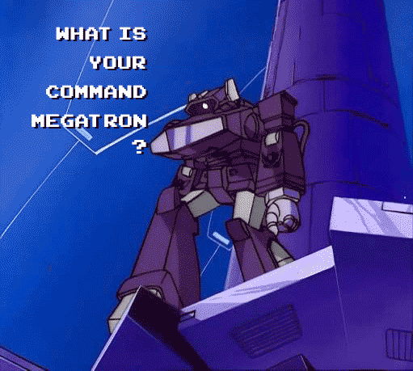

# Shockwave

*(Описание на русском ниже)*

**Shockwave** is an open-source, local-first background voice dictation tool for Windows. It allows you to dictate text via a global hotkey, automatically normalizes punctuation and tech terminology using an LLM, and copies the resulting text directly to your clipboard.

### Speech Recognition Models (STT):
- **Whisper (`large-v3-turbo`)**: State-of-the-art turbo model by OpenAI, optimized for speed. Ideal for mixed English/Russian speech and programming terminology. Runs locally via `faster-whisper`.
- **GigaAM (`gigaam-v3-e2e-rnnt`)**: ONNX version of Sber's GigaAM acoustic model, ported by Ilya Stupakov for fast CPU execution. Runs in `int8` or `float32` format via `onnx-asr`.

### Text Normalization Engine (LLM):
- **Gemini (`gemini-2.5-flash-lite`) / OpenAI Compatible**: Lightweight, fast AI model used for punctuation restoration, formatting, and technical term capitalization.

## Features
* **Global Hotkey:** Default `F12`. Works across any Windows application.
* **Dual Speech-to-Text (STT):** Choose between Whisper (mixed IT speech) and GigaAM (ultra-fast Russian speech).
* **Fully Portable & Offline Ready:** All downloaded neural network models are stored locally inside the project's `models/` directory.
* **Bilingual Interactive Launcher:** Console control panel supporting language switching (English / Russian), model management, and API key configuration.
* **Minimalist Floating Widget:** Clean on-screen status indicators with checkboxes to toggle LLM normalization and audio alerts.
* **Audio Notifications:** Subtle sound notification plays when transcription is copied and ready to paste.
* **Safe Terminal Logging:** The console maintains a real-time transcript history to ensure no dictated text is lost in current session.

## Documentation & Installation
Detailed guides are available below:

🇬🇧 **[Setup Guide (English)](docs/shockwave_setup_guide_eng.md)**  
🇷🇺 **[Руководство по настройке (Русский)](docs/shockwave_setup_guide_rus.md)**

---

# Shockwave

**Shockwave** — это легковесный инструмент для голосовой диктовки на Windows, работающий в фоновом режиме. Он позволяет надиктовывать текст по нажатию глобальной горячей клавиши, автоматически расставляет знаки препинания с помощью нейросети и копирует результат в буфер обмена.

### Модели распознавания речи (STT):
- **Whisper (`large-v3-turbo`)**: Новая турбо-версия большой модели Whisper от OpenAI. Идеальна для смешанной русско-английской речи и IT-терминов. Запускается локально через `faster-whisper`.
- **GigaAM (`gigaam-v3-e2e-rnnt`)**: ONNX-версия нейросети GigaAM от Сбера, портированная Ильей Ступаковым для работы на процессорах. Загружается в версии `int8` или `float32` через `onnx-asr`.

### Движок нормализации текста (LLM):
- **Gemini (`gemini-2.5-flash-lite`) / OpenAI-совместимый**: Быстрая языковая модель от Google для восстановления пунктуации, форматирования и исправления опечаток.

## Возможности
* **Глобальная кнопка:** По умолчанию `F12`. Работает в любых программах Windows.
* **Два движка распознавания (STT):** Быстрый выбор между Whisper (для смешанной IT-речи) и GigaAM (очень быстрый для русской речи).
* **Полная портативность:** Все скачиваемые модели сохраняются локально в папку `models/` внутри проекта.
* **Двуязычная панель управления:** Консольный лаунчер с поддержкой переключения языка (RU / EN), проверки моделей и настройки API-ключа.
* **Минималистичный виджет:** Аккуратная плашка статуса с переключателями LLM-нормализации и звуковых оповещений.
* **Звуковой сигнал:** Аудио-оповещение при успешном завершении диктовки.
* **Бекап-лог:** Консоль сохраняет лог и всю историю расшифровок, исключая потерю надиктованного текста в рамках открытой сессии.

## Документация и Установка
Подробные инструкции по установке:

🇬🇧 **[Setup Guide (English)](docs/shockwave_setup_guide_eng.md)**  
🇷🇺 **[Руководство по настройке (Русский)](docs/shockwave_setup_guide_rus.md)**